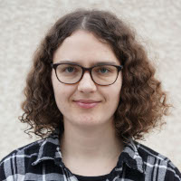
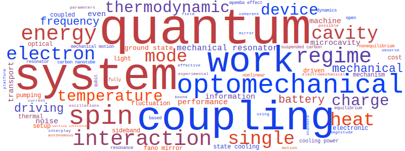

.. Juliette Monsel website master file, created by
   sphinx-quickstart on Thu Oct 15 14:40:32 2020.
   You can adapt this file completely to your liking, but it should at least
   contain the root `toctree` directive.

Juliette Monsel
===============

  
I am a researcher in the group `Dynamics and thermodynamics of nanoscale devices <https://sites.google.com/site/splettchalmers/research-group>`_, in the `Applied Quantum Physics Laboratory <https://www.chalmers.se/en/departments/mc2/research/applied-quantum-physics/>`_, in the Department of Microtechnology and Nanoscience at Chalmers University of Technology, in Gothenburg, Sweden. 

I did my Ph.D. under the supervision of `Alexia Auffèves <https://quantum-energy-team.cnrs.fr/>`_
at the `Institut Néel <https://neel.cnrs.fr/>`_ (CNRS, Université Grenoble Alpes) in Grenoble, France. 
My thesis dissertation, entitled *Quantum Thermodynamics and Optomechanics*, was awarded a Springer Thesis Award and published in 
the `Springer Theses series <https://www.springer.com/gp/book/9783030549701>`_ in 2020. Since 2020, I have been working with `Janine Splettstoesser <https://sites.google.com/site/splettchalmers>`_ at Chalmers, first as a postdoctoral researcher and, since 2024, as a permanent researcher. I am also collaborating closely with `Witlef Wieczorek's experimental group <https://wieczorek-lab.com/>`_ at Chalmers on cavity optomechanics.

    
    Image generated with `WordCloud <https://github.com/amueller/word_cloud>`_ from my arXiv abstracts.

 
My research interests are:

- quantum thermodynamics
- open quantum systems
- optomechanics
- quantum optics
- electronic transport

|

------------
    
News
----

.. include:: news.rst
        

.. toctree::
    :maxdepth: 3
    :hidden:
    :caption: My research webpage:
    
    CV
    Research
    Publications
    Conferences
    Teaching
    Positions
    Contact

